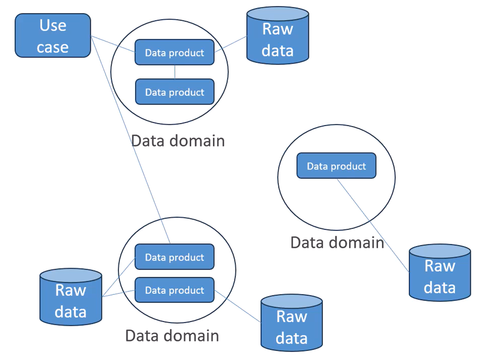
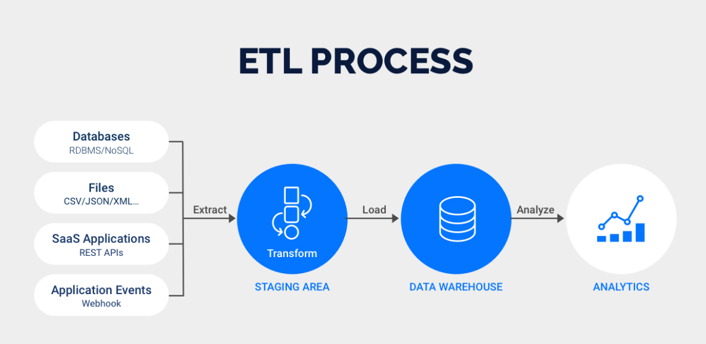
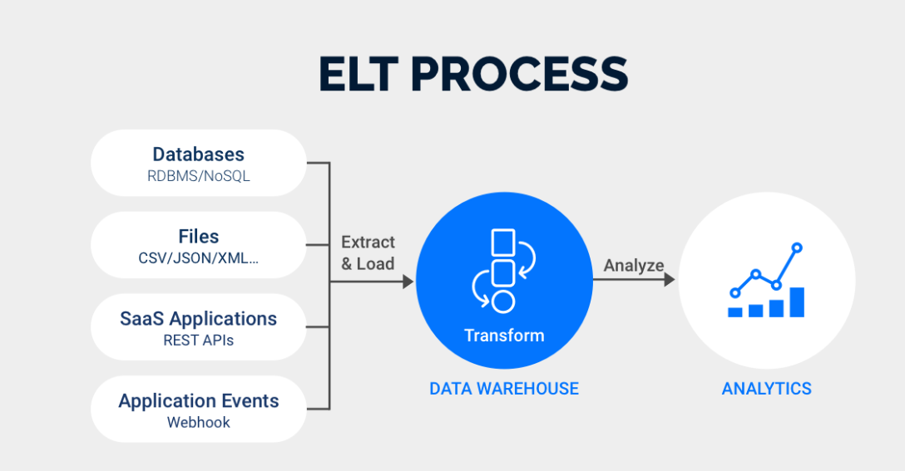

# AWS DEA-C01 certification
## EXAM CONTENT
The AWS Certified Data Engineer - Associate (DEA-C01) exam has a pass or fail
designation. The exam is scored against a minimum standard established by AWS
professionals who follow certification industry best practices and guidelines.
Your results for the exam are reported as a scaled score of 100–1,000. The minimum
passing score is 720 from 50 questions along with 15 unscored questions. 

- Domain 1: Data Ingestion and Transformation (34% of scored content)
- Domain 2: Data Store Management (26% of scored content)
- Domain 3: Data Operations and Support (22% of scored content)
- Domain 4: Data Security and Governance (18% of scored content)

[AWS-Certified-Data-Engineer-Associate_Exam-Guide](https://d1.awsstatic.com/training-and-certification/docs-data-engineer-associate/AWS-Certified-Data-Engineer-Associate_Exam-Guide.pdf)

## Data Engineering Fundamentals
### Types of Data

1. Structured Data 
    - Data is organized in defined manner(rows and columns of well defined data) or schema found in RDS.
    - Characteristics:
        - Easily queryable
        - Organized in rows and columns
        - Has a consistent structure
    - Examples:
        - CSV with consistent columns
        - RDS Database tables(MySQL, Oracle, Postgres SQL)
        - Excel Spreadsheets
2. UnStructured Data 
    - Data is does not have a predifined structured or schema.
    - Characteristics:
        - Not Easy to query
        - comes without preprocessing
        - May come in various formats
    - Examples:
        - Text files without a fixed format(log files, emails,config files), Videos , Audios, Images
        - Need indexing to extract information
3. Semi-Structured Data 
    - Data is not as organized or structured but does have some structure in form of tags,patterns,hierarchies.
    - Structure is in there  
    - Characteristics:
        - Elements might be tagged or categorized in some way
        - More flexible that Structured Data and less chaotic than UnStructured data
        - May come in various formats
    - Examples:
        - XML, JSON, Email headers, log files

### Properties of Data
| **Characteristic** | **Description**                                                                                         |
|--------------------|---------------------------------------------------------------------------------------------------------|
| **Volume**         | Refers to the vast amounts of data generated every second. Big data involves large volumes of data.     |
| **Variety**        | Refers to the different types of data (structured, semi-structured, unstructured) from various sources. |
| **Velocity**       | Refers to the speed at which data is generated, processed, and analyzed.                                |
| **Veracity**       | Refers to the accuracy and trustworthiness of the data.                                                 |
| **Value**          | Refers to the worth of the data being collected and how it can be turned into valuable insights.        |
| **Variability**    | Refers to the inconsistency of the data, which can affect processes that handle and manage it.          |

### data warehouse vs data lake vs data lakehouse 
- Data Warehouse: Best for structured data and complex queries with strong data governance.
- Data Lake: Best for storing vast amounts of diverse data for big data analytics and machine learning.
- Data Lakehouse: Combines the benefits of both, providing a unified platform for diverse data types, with the performance and governance of data warehouses and the scalability and flexibility of data lakes.

| Feature                    | Data Warehouse                                     | Data Lake                                           | Data Lakehouse                                      |
|----------------------------|----------------------------------------------------|-----------------------------------------------------|-----------------------------------------------------|
| **Definition**             | Centralized repository for structured data         | Centralized repository for structured, semi-structured, and unstructured data | Unified platform combining features of data lakes and data warehouses |
| **Data Type**              | Structured data                                    | Structured, semi-structured, and unstructured data  | Structured, semi-structured, and unstructured data  |
| **Schema**                 | Schema-on-write                                    | Schema-on-read                                      | Supports both schema-on-write and schema-on-read    |
| **Data Processing**        | Batch processing                                   | Batch and real-time processing                      | Batch and real-time processing                      |
| **Storage Cost**           | Typically higher                                   | Typically lower                                     | Intermediate, leveraging cost-effective storage of data lakes and performance of warehouses |
| **Performance**            | High performance for complex queries               | Variable performance depending on the workload      | High performance for complex queries                |
| **Data Governance**        | Strong data governance and management              | Varies, can be less structured                      | Enhanced data governance combining both approaches  |
| **Use Cases**              | Business intelligence, reporting, and data analysis| Big data analytics, machine learning, and data exploration | Business intelligence, advanced analytics, and machine learning |
| **Accessibility**          | SQL-based tools and BI platforms                   | Diverse tools (e.g., Hadoop, Spark)                 | SQL-based tools, BI platforms, and big data tools   |
| **Scalability**            | Scalable but may require more resources to scale   | Highly scalable with distributed storage systems    | Highly scalable leveraging both distributed storage and computing |
| **Data Update**            | Handles updates and transactions efficiently       | Less efficient at handling updates and transactions | Efficient handling of updates and transactions      |
| **Compliance**             | Easier to enforce compliance and security policies | Harder to enforce due to diverse data formats       | Enhanced compliance with unified security model     |
| **Examples**               | Amazon Redshift, Google BigQuery, Snowflake        | Hadoop HDFS, Amazon S3, Azure Data Lake Storage     | Databricks Lakehouse, Snowflake, Amazon Redshift Spectrum |

### Data Mesh
It is a decentralized data architecture paradigm that addresses the challenges of scalability and ownership in modern data ecosystems by shifting from a centralized data lake or data warehouse approach to a distributed data mesh approach. It focuses on treating data as a product and emphasizes domain-oriented ownership.

### ETL/ ELT Pipelines
- ETL, which stands for Extract, Transform, and Load, involves transforming data on a separate processing server before transferring it to the data warehouse.

- ELT, on the other hand, or Extract, Load, and Transform, performs data transformations directly within the data warehouse itself. Unlike ETL, ELT allows for raw data to be sent directly to the data warehouse, eliminating the need for staging processes.

