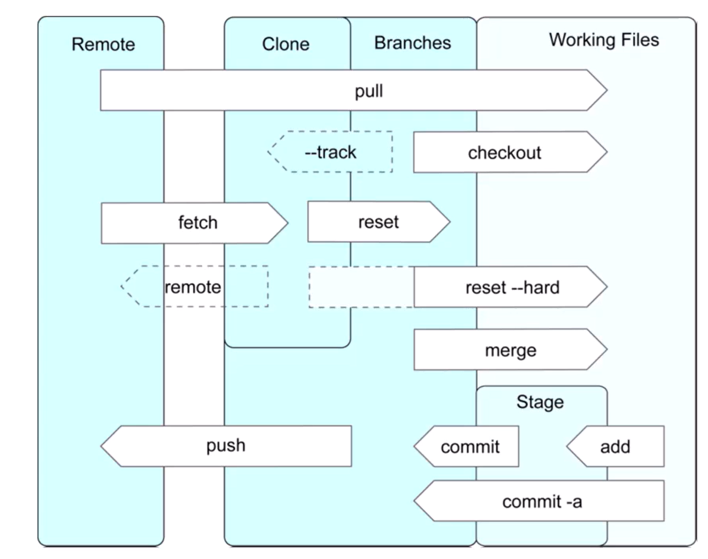

# Git
## What is Git?

### Git Review

### Git Commands

### Branching with git

### Pivoting

### Joins
- Inner Join
- Left Outer Join
- Right Outer Join
- Cross Outer Join

### SQL Regular Expressions
- Pattern Matching
    - Like
    - ~
    - ~*
    - !~*

